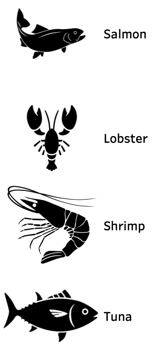
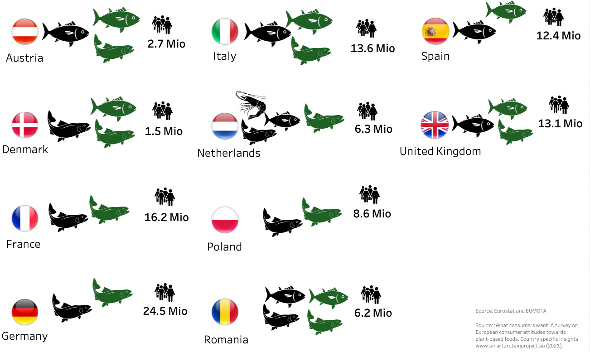

# Veggi Fish - Potential european markets for plant-based seafood alternatives

Final project at the Data Analytics Bootcamp [@neuefische](https://www.neuefische.de/). This project has been developed in 4 weeks during June and July 2022 by Aida Casado Perez ([LinkedIn](https://www.linkedin.com/in/aida-casado-p%C3%A9rez-7561a9b7/)), Felix Neugebauer ([LinkedIn](https://www.linkedin.com/in/felix-neugebauer-7910481ba/)) and Nina Steinhübel ([LinkedIn](https://www.linkedin.com/in/nina-steinhuebel-2714b5140)).  
Please feel free to contact us.

## Business Context: Support Start-Up Numifoods with finding potential markets
Numifoods is a Start-Up from Berlin which is developing plant-based seafood alternatives. Before launching their first product they needed an advanced market research to find potential launching markets in Europe. 

## Scope
The scope for the project was defined in advanced with Numifoods as our Stakeholder.   
- The focus is on the following species:

  

  

- The focus countries are: Austria, Germany, Poland, Denmark, United Kingdom, Spain, Italy, Netherlands, France and Romania  

- The focus target group includes: Flexitarians, Vegetarians, Vegans and Pescetarians between 18 and 70 years

The time frame for our analysis include the years 2010 until 2021.

## Goal: Recommendations for potential markets
The outcome of this project is to answer three main questions in order to provide Numifoods with appropriate recommendations on which European country to introduce which of their alternative plant-based products.

The three main questions are:
1) Which conventional fish species are consumed the most in each of the selected countries?    
2) Which plant-based seafood alternatives do customers want?  
3) How big is the possible target group in each selected country?  

## Data Overview
To give answers to the three above mentioned questions we collected data on the following topics:
1) Fish catch and aquaculture production within Europe
2) Export and import volumes for selected species and countries 
3) Consumer behavior regarding plant-based diets and plant-based seafood preferences

Data in 1. and 2. were only dedicated to human consumption.  
All data is available in open sources.   
Our main sources were: 
[Eumofa](https://www.eumofa.eu/), [Eurostat](https://ec.europa.eu/eurostat), [FAO](https://www.fao.org/home/en), [Eurobarometer](https://europa.eu/eurobarometer/screen/home), [SmartProtein Project](https://smartproteinproject.eu/)  

## Data cleaning overview
After collecting and evaluating all data sources we cleaned the data with the following cleaning guideline:

Step 1: Import files and create dataframes with individual variables

Step 2: Inspect dataframes

Step 3: Delete non necessary columns and rows

Step 4: Unify columns for better comparability

Step 5: Unify rows for better comparability

Step 6: Replace (country/species) abbreviations with full names by using dictionaries

Step 7: Inspect null values / naNs

Step 8: Autofill null values in nested rows when merged cells in excel/csv file is empty

Step 9: Change data types:

- year = integer  
- volume = float, round to one decimal. Convert kilograms into tonnes (1t = 1000 kg)  
- value = float, round to two decimals  

Step 10: Species cleaning

- Aggregate species as main_commercial_species
- Sum up main_commercial_species in categories_species:   
    - crustaceans: shrimps and lobster
    - pelagic fish: tuna and salmon

Step 11: Check language = english

Step 12: Merging dataframes

## Data analysis overview
After data cleaning and final merging we got our final dataframes and stored them in PostgreSQL. Afterwards we performed first EDA with Python using Pandas and Matplotlib. For further EDA and visualizations we used Tableau.

Our main calculation was the approximate consumption of conventional seafood, which we obtained by adding the fish catch/ aquaculture and import volumes minus the export volume for each species. With these values we were able to calculate the approximated consumption per capita for each country.

The most favorite plant-based seafood alternatives were calculated by summing up the results of Smart Protein's consumer behavior study which was focusing on plant-based diets within our selected countries.

The size of the target groups was calculated by adding up the relative share of flexitarians, vegetarians, vegans and pescetarians multiplied by the countries' population between 18 and 70 years. 

The results of approximated consumption and most favorite plant-based seafood alternative in combination with the potential size of the target groups in each country were our main indicators for our outcome.

## Outcome
Legend:  
black fish = most consumed conventional species  
green fish = most wished plant-based seafood alternative  
number = target group size  

  

